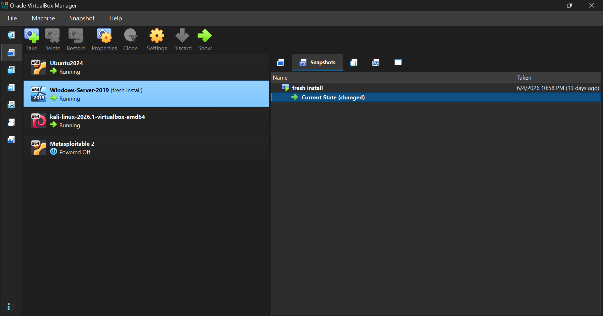
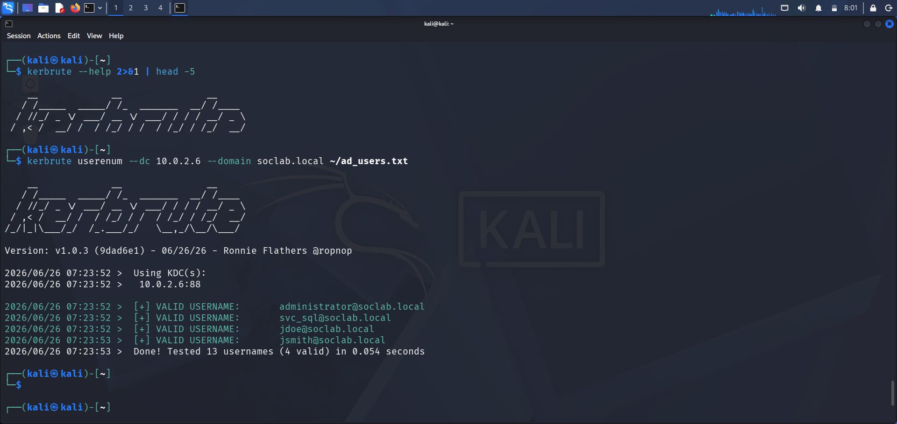
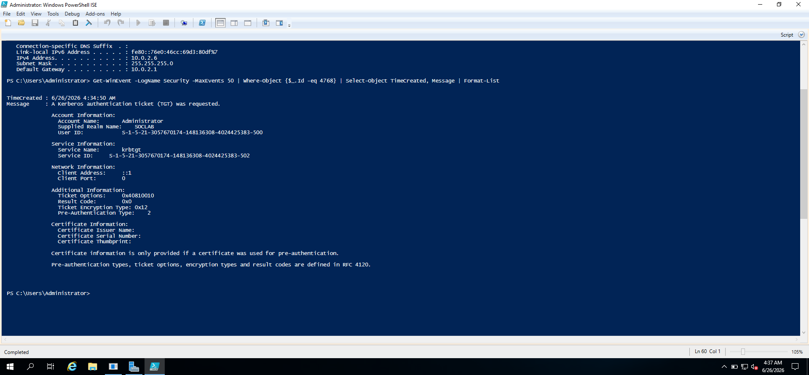
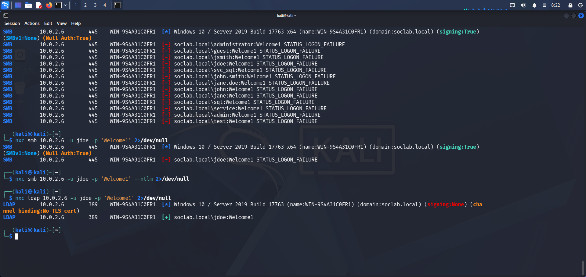
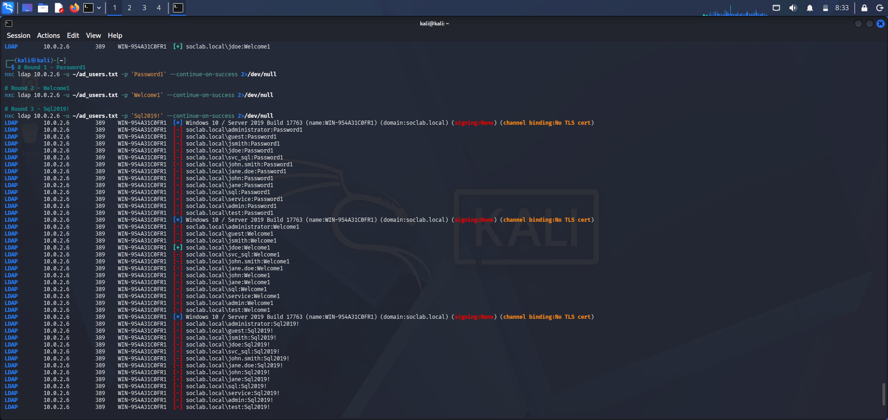
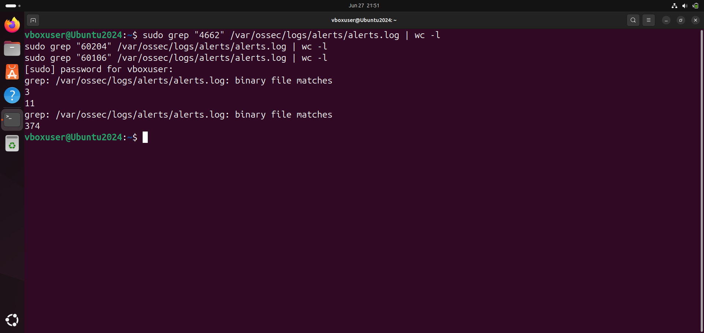
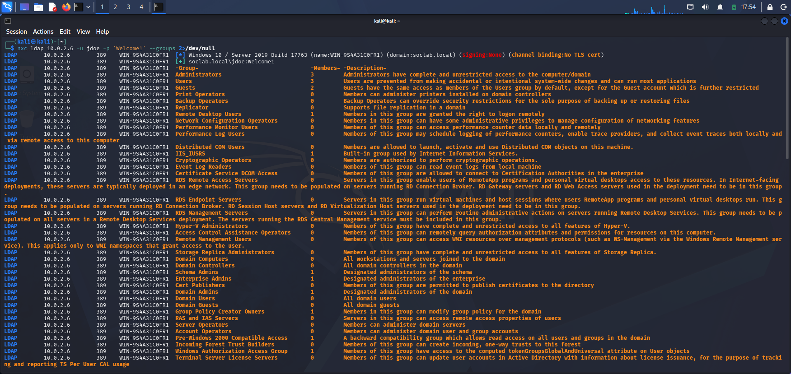
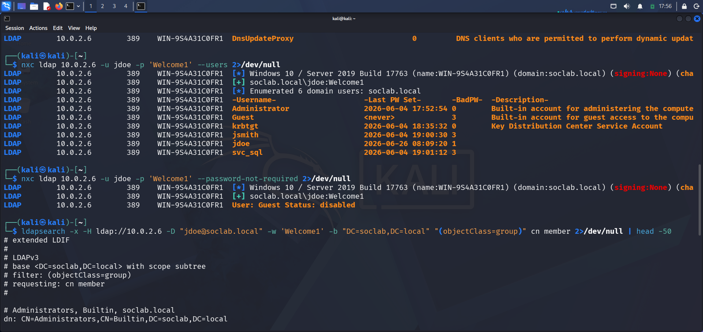
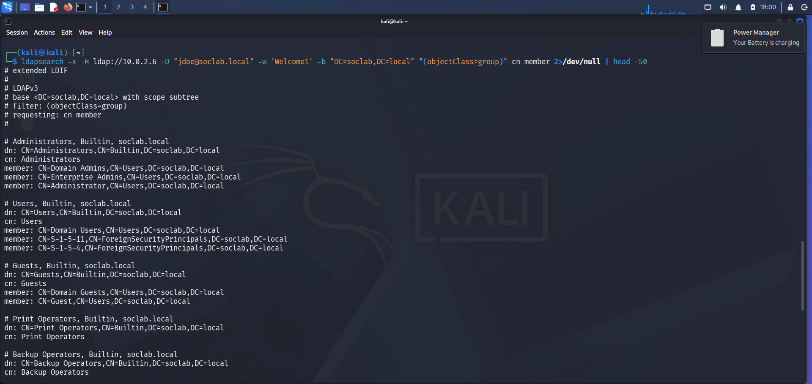

# Active Directory Attack Detection Lab

**MITRE ATT&CK:** T1087.002 · T1110.003 · T1069.002  
**Attack Phases:** 3 — Enumeration → Password Spraying → Privilege Discovery  
**Credentials Compromised:** 2 (jdoe, svc_sql)  
**Detection Rate:** 1 of 3 phases detected by default Wazuh configuration  
**Outcome:** Partial detection ⚠️ | Two critical gaps identified ✅

---

## Why this project matters

In Project 3, the attack was loud. One tool, one target, one port. Wazuh caught it — barely, and 60 milliseconds too late. But at least it caught it.

Project 4 is different. This time I simulated how attackers actually move through a Windows Active Directory environment before they start breaking things. They don't just hammer passwords. They map the terrain first — quietly, patiently, using protocols the network was designed to speak.

The question I wanted to answer: **if an attacker moved through my AD environment in three deliberate phases, which phases would my SIEM catch — and which would it miss completely?**

The answer was uncomfortable. Out of three attack phases, Wazuh only detected one.

---

## The three-phase attack chain

Real AD attacks don't start with credential brute force. They start with reconnaissance. This project follows the realistic attack progression:

```
Phase 1 — Enumeration (T1087.002)
  └─ Map the domain: who's here, what groups exist, what accounts are valid
  
Phase 2 — Password Spraying (T1110.003)  
  └─ Try common passwords against discovered accounts
  └─ One password at a time across all accounts (stays under lockout threshold)
  
Phase 3 — Privilege Discovery (T1069.002)
  └─ Use compromised credentials to map group memberships
  └─ Find the path to higher access
```

**Wazuh detected Phase 2. Phases 1 and 3 were invisible.**

---

## Lab environment

| Machine | Role | IP |
|---|---|---|
| Ubuntu 24.04 + Wazuh Manager | SIEM — receives and correlates all alerts | 10.0.2.4 |
| Windows Server 2019 + AD DS + Wazuh Agent + Sysmon | Domain Controller — target | 10.0.2.6 |
| Kali Linux | Attack machine | 10.0.2.5 |

**Domain:** soclab.local  
**Domain Controller:** WIN-9S4A31C0FR1  
**Network:** VirtualBox NAT Network (10.0.2.0/24)

**Domain users in scope:**

| Account | Type | Password set for lab |
|---|---|---|
| Administrator | Domain Admin | Strong |
| jsmith | Standard user | Password1 |
| jdoe | Standard user | Welcome1 |
| svc_sql | Service account | Svc2026 |

**Timezone note:** Kali runs EDT (UTC-4). Wazuh Manager runs UTC. All log timestamps are UTC.


*Lab environment — Ubuntu (Wazuh), Windows Server 2019 (DC + target), Kali Linux (attacker)*

---

## Tools used

| Tool | Phase | Purpose |
|---|---|---|
| enum4linux v0.9.1 | Phase 1 | SMB-based domain enumeration |
| ldapsearch | Phase 1 | LDAP directory queries |
| Kerbrute v1.0.3 | Phase 1 | Kerberos username enumeration |
| netexec (nxc) v1.5.1 | Phase 2 + 3 | Password spraying + authenticated enumeration |
| Nmap 7.98 | Pre-attack | Port verification |

---

## Phase 1 — Enumeration (T1087.002)

### What I was trying to do

Before touching a single password, I wanted to see how much information an unauthenticated attacker could pull from this domain. No credentials. Just network access and the protocols the DC was designed to speak.

### Pre-attack verification

```bash
# Confirm all ports are accessible
nmap -p 389,445,636,3389 10.0.2.6
```

All four ports returned `open` — LDAP (389), SMB (445), LDAPS (636), RDP (3389). The DC was fully exposed on standard AD ports.

### Attempt 1 — SMB enumeration with enum4linux

```bash
enum4linux -a 10.0.2.6 2>/dev/null
```

**What it got:**
- Domain name: `SOCLAB`
- Domain SID: `S-1-5-21-3057670174-148136308-4024425383`
- DC hostname: `WIN-9S4A31C0FR1`
- NULL sessions allowed — server accepts empty username/password

**What was blocked:**
- Direct user enumeration: `NT_STATUS_ACCESS_DENIED`
- Share enumeration: failed
- RID cycling: `STATUS_ACCESS_DENIED`

Your DC blocked direct SMB user enumeration. Partial hardening — domain metadata leaked but user accounts didn't.

### Attempt 2 — Anonymous LDAP query

```bash
ldapsearch -x -H ldap://10.0.2.6 -b "DC=soclab,DC=local" "(objectClass=user)" sAMAccountName 2>/dev/null
```

Result:
```
result: 1 Operations error
comment: In order to perform this operation a successful 
bind must be completed on the connection.
```

Anonymous LDAP also blocked. The DC required authentication before answering directory queries.

### Attempt 3 — Kerberos username enumeration with Kerbrute

SMB and LDAP both blocked. So I pivoted to a technique that doesn't need either.

Kerbrute works by sending Kerberos AS-REQ packets directly to port 88. The Kerberos protocol responds differently to valid versus invalid usernames — without requiring a password. Valid username gets `PREAUTH_REQUIRED`. Invalid username gets `PRINCIPAL_UNKNOWN`. Kerbrute reads those responses.

```bash
kerbrute userenum --dc 10.0.2.6 --domain soclab.local ~/ad_users.txt
```


*Kerbrute confirming 4 valid domain accounts in 0.054 seconds — no credentials required, no authentication attempted*

```
[+] VALID USERNAME: administrator@soclab.local
[+] VALID USERNAME: svc_sql@soclab.local
[+] VALID USERNAME: jdoe@soclab.local
[+] VALID USERNAME: jsmith@soclab.local
Done! Tested 13 usernames (4 valid) in 0.054 seconds
```

4 confirmed valid accounts. In under a second. Without a single credential.

### What Wazuh saw during Phase 1

**Zero alerts. Zero Windows events from 10.0.2.5.**

I verified this on Windows Server directly:

```powershell
Get-WinEvent -LogName Security | Where-Object {$_.Id -eq 4768} | 
Where-Object {$_.Message -like "*10.0.2.5*"} | Format-List
```

Empty output. No Event ID 4768 from the attacker IP. No Event ID 4771.


*The only 4768 event on Windows is from localhost (::1) — not from the attacker at 10.0.2.5. Kerbrute left zero trace.*

**Why Kerberos enumeration is invisible:**

Windows only logs Event ID 4768 when a full Kerberos TGT is issued, and 4771 when pre-authentication fails with a password attempt. Kerbrute never sends a password — it only sends the username portion of the AS-REQ. Windows never reaches the point where it writes a log entry.

The attacker learned who exists in your domain. Your SIEM learned nothing.

**Phase 1 detection result: 0 alerts**

---

## Phase 2 — Password Spraying (T1110.003)

### What spraying is and why it's different from brute force

**Brute force** (Project 3): many passwords → one account → fast  
**Password spraying** (Project 4): one password → many accounts → deliberate pace

Spraying stays under lockout thresholds because each account only sees one attempt per round. With `LockoutThreshold: 0` in this lab, there was no threshold to worry about — but the technique and the log pattern are what matter for detection.

### The SMB problem — and the protocol pivot

First spray attempt used SMB:

```bash
nxc smb 10.0.2.6 -u ~/ad_users.txt -p 'Password1' --continue-on-success 2>/dev/null
```

All results returned `STATUS_LOGON_FAILURE` — including accounts with correct passwords.

The culprit: `signing:True` in the SMB response. The DC required signed SMB sessions. netexec's authentication was failing at the signing negotiation layer, not the credential layer.


*SMB spray returns all failures including valid credentials. Single LDAP test immediately confirms jdoe:Welcome1. Protocol pivot from SMB to LDAP bypassed the signing requirement.*

**Fix: pivot to LDAP:**

```bash
nxc ldap 10.0.2.6 -u jdoe -p 'Welcome1' 2>/dev/null
# [+] soclab.local\jdoe:Welcome1
```

LDAP has no signing requirement. `signing:None` in the LDAP response. SMB hardening didn't stop the attack — it redirected it.

### Three spray rounds via LDAP

```bash
# Round 1
nxc ldap 10.0.2.6 -u ~/ad_users.txt -p 'Password1' --continue-on-success 2>/dev/null

# Round 2  
nxc ldap 10.0.2.6 -u ~/ad_users.txt -p 'Welcome1' --continue-on-success 2>/dev/null

# Round 3
nxc ldap 10.0.2.6 -u ~/ad_users.txt -p 'Svc2026' --continue-on-success 2>/dev/null
```


*Three password spray rounds. Round 2 confirms jdoe:Welcome1 with [+]. All other accounts return [-]. 39 total authentication attempts across 3 rounds.*

**Results:**
- Round 1 (Password1): 0 successes
- Round 2 (Welcome1): 1 success — `jdoe:Welcome1` ✅
- Round 3 (Svc2026): 1 success — `svc_sql:Svc2026` ✅

### The SubStatus forensic finding

Inside every Event ID 4625, there's a SubStatus code that tells you *why* the logon failed:

| SubStatus | Meaning | Attacker value |
|---|---|---|
| `0xC000006A` | Wrong password — account exists | Confirms valid username |
| `0xC0000064` | Account does not exist | Eliminates guessed username |

Real domain accounts (`administrator`, `jsmith`, `jdoe`, `svc_sql`) returned `0xC000006A`.  
Non-existent accounts (`john`, `jane`, `sql`, `service`, `admin`, `test`) returned `0xC0000064`.

A SOC analyst reading these logs can separate real accounts from guesses without needing to know which passwords were correct. The failure code leaks account validity.

### What Wazuh saw during Phase 2

Rule 60204 fired — Multiple Windows Logon Failures, level 10 critical.


*Detection counts: 3 directory object access events (4662), 11 brute force correlation alerts (60204), 374 successful logon events (60106)*

**But here's the critical gap:**

Wazuh fired the same rule — 60204 "Multiple Windows Logon Failures" — for password spraying as it did for RDP brute force in Project 3. Same rule. Same description. Same severity level.

Wazuh cannot distinguish between:
- Brute force: 50 attempts against jsmith in 5 seconds
- Password spraying: 1 attempt each against 13 accounts in 5 seconds

Both generate 4625 events. Both trigger Rule 60204. The response to each should be completely different — brute force response is account-level, spray response is environment-level. But the SIEM gives you the same alert for both.

**Phase 2 detection result: Rule 60204 fired (level 10) — but technique misclassified**

---

## Phase 3 — Privilege Discovery (T1069.002)

### What I was trying to find

With `jdoe:Welcome1` confirmed, the attacker's next question is: what can this account actually do? What groups exist? Who's in Domain Admins? Is there a path to higher access?

### Authenticated LDAP enumeration

```bash
# Full group enumeration using jdoe credentials
nxc ldap 10.0.2.6 -u jdoe -p 'Welcome1' --groups 2>/dev/null

# All domain users with metadata
nxc ldap 10.0.2.6 -u jdoe -p 'Welcome1' --users 2>/dev/null

# Authenticated ldapsearch for group memberships
ldapsearch -x -H ldap://10.0.2.6 -D "jdoe@soclab.local" -w 'Welcome1' \
  -b "DC=soclab,DC=local" "(objectClass=group)" cn member 2>/dev/null
```


*Authenticated LDAP enumeration with jdoe credentials reveals the complete domain group structure — 47 groups, membership counts, and descriptions*


*The --users output reveals 6 domain accounts with last password set dates and bad password attempt counts — the attacker's own spray attempts are visible as BadPW entries*


*Authenticated ldapsearch reveals group membership structure — Administrators group contains Domain Admins, Enterprise Admins, and Administrator only*

**What the attacker learned:**

- Domain Admins: 1 member (Administrator only)
- jdoe and svc_sql have no privileged group membership
- No unexpected accounts in sensitive groups
- BadPW counts reveal the attacker's own spray activity

**Key finding — svc_sql couldn't enumerate but jdoe could:**

When the same queries were run with svc_sql credentials, all returned `[-]`. svc_sql is restricted from reading the AD directory even though it has valid credentials. jdoe, as a standard domain user, has default read access to the directory.

This reveals which account an attacker prioritises for post-compromise reconnaissance — valid credentials aren't enough, you need an account with directory read permissions.

### What Wazuh saw during Phase 3

3 Event ID 4662 entries were logged — directory object access events from the authenticated LDAP queries. But Wazuh has no correlation rule that fires when a single account queries multiple sensitive AD objects in a short window.

Each 4662 was logged individually as a low-level event with no associated alert. An analyst would have to manually search for 4662 events to find them — they would never surface through standard alert triage.

**Phase 3 detection result: 3 events logged, 0 alerts fired**

---

## Complete findings summary

### Detection scorecard

| Phase | Technique | MITRE ID | Wazuh Detected? | Evidence |
|---|---|---|---|---|
| Enumeration | Username discovery via Kerberos | T1087.002 | ❌ No | Zero Windows events from 10.0.2.5 |
| Password Spraying | LDAP credential spray | T1110.003 | ⚠️ Partial | Rule 60204 fired, technique misclassified |
| Privilege Discovery | Authenticated AD enumeration | T1069.002 | ❌ No | 4662 logged, no alert |

### Alert counts

| Metric | Count |
|---|---|
| Rule 60122 — individual logon failures | 62 |
| Rule 60204 — brute force correlation | 11 |
| Event ID 4662 — directory object access | 3 |
| Total attacker events from 10.0.2.5 | 382 |
| Phases where attacker operated undetected | 2 of 3 |

### Finding 1 — Kerbrute enumeration is completely invisible

Kerberos username enumeration via AS-REQ packets leaves zero trace in Windows event logs and zero alerts in Wazuh. The technique exploits a gap in what Kerberos considers worth logging — it only logs full authentication attempts, not username-only probes.

An attacker can enumerate your entire domain user list in under a second, from an unauthenticated position, without generating a single Windows Security event.

### Finding 2 — SMB hardening redirected the attack but didn't stop it

SMB signing (`signing:True`) blocked netexec's SMB-based credential spray. But LDAP (port 389) has no equivalent signing requirement. The attacker pivoted from SMB to LDAP and the spray succeeded. Hardening one protocol without hardening equivalent protocols just changes the attacker's route — it doesn't close the door.

### Finding 3 — Wazuh cannot distinguish brute force from password spraying

Rule 60204 fires on volume of 4625 events regardless of how many accounts are targeted. A SOC analyst receiving this alert during a spray doesn't know whether to investigate one account or all accounts. The response playbook for each is fundamentally different.

### Finding 4 — Authenticated AD enumeration generates no alerts

Once an attacker has valid credentials, querying the AD directory generates Event ID 4662 entries but no Wazuh alerts. Standard domain users have read access to the entire directory by default — meaning any compromised standard account immediately gives the attacker a full map of the domain structure.

### Finding 5 — BadPW counts expose the attacker's own footprint

Event ID 4625 failures increment the badPwdCount attribute on AD user objects. When the attacker queries `--users` after spraying, they can see their own spray attempts reflected in the BadPW column. This is a forensic artifact — a SOC analyst who checks badPwdCount patterns during investigation can reconstruct which accounts were targeted and in what order, even without reviewing individual 4625 events.

### Finding 6 — Service account permissions matter post-compromise

svc_sql had valid credentials but couldn't enumerate the AD directory. jdoe, as a standard domain user, had full read access. This demonstrates that not all compromised accounts are equal for post-compromise reconnaissance — account type determines what intelligence the attacker can gather after the initial breach.

---

## What I'd build next to close these gaps

**For the Kerbrute gap:**
Enable Kerberos audit logging at a lower threshold. Specifically, audit Event ID 4768 failures from external IPs. While Kerbrute doesn't generate traditional 4768 failures, deploying a honeypot account — a fake username that should never have authentication attempts — will catch any enumeration tool that probes it.

**For the spray detection gap:**
Write a custom Wazuh rule that fires when 4625 events come from one source IP but target more than 3 different accounts within 60 seconds. That pattern is diagnostic of spraying versus brute force and should trigger a different response playbook.

**For the privilege discovery gap:**
Build a Wazuh rule that correlates 4662 events — when a single account queries sensitive AD objects (Domain Admins, Enterprise Admins, Schema Admins) within a short window, fire a medium-severity alert for analyst review.

**For the SMB/LDAP gap:**
Enable LDAP signing and channel binding on the DC. This is a Microsoft-recommended hardening step that forces LDAP clients to authenticate signing the same way SMB does.

```powershell
# Enable LDAP signing requirement on DC
Set-ItemProperty -Path "HKLM:\System\CurrentControlSet\Services\NTDS\Parameters" `
  -Name "LDAPServerIntegrity" -Value 2
```

---

## Analyst investigation checklist for this alert pattern

If you receive Rule 60204 (Multiple Windows Logon Failures) and suspect it may be a spray rather than brute force, check these immediately:

**1. How many unique target accounts?**
```
Single account = brute force (T1110.001) → account-level response
Multiple accounts = spray (T1110.003) → environment-level response
```

**2. Check SubStatus codes in the 4625 events**
`0xC000006A` = valid account, wrong password  
`0xC0000064` = account doesn't exist  
A mix means the attacker is guessing usernames AND passwords simultaneously.

**3. Check badPwdCount on all domain accounts**
```powershell
Get-ADUser -Filter * -Properties badPwdCount, badPasswordTime | 
Where-Object {$_.badPwdCount -gt 0} | 
Select-Object Name, SamAccountName, badPwdCount, badPasswordTime |
Sort-Object badPwdCount -Descending
```
Multiple accounts with incremented badPwdCount in the same time window = spray confirmed.

**4. Check for successful logons following the failures**
Did any 4624 events follow the 4625 pattern from the same source IP? If yes — the spray found a valid credential. Pivot to investigating what that account did after authentication.

**5. Check 4662 events for post-compromise AD enumeration**
If a compromised account started querying AD objects, the attacker already has your domain map.

---

## Repository structure

```
active-directory-attack-detection/
├── README.md                           ← You are here
├── screenshots/
│   ├── 01_lab_architecture.png         ← VirtualBox — all VMs running
│   ├── 02_Grep_output.png              ← Detection counts summary
│   ├── 03_group_enumeration.png        ← Phase 3 — group enumeration via jdoe
│   ├── 04_Kerbrute.png                 ← Phase 1 — username enumeration
│   ├── 05_nxc_LDAP_spray.png          ← Phase 2 — spray rounds
│   ├── 06_ldap_auth.png               ← Protocol pivot finding
│   ├── 08_same_time_spraying.png      ← Phase 2 — confirmed jdoe credential
│   ├── 09_ldapsearch_groups.png       ← Phase 3 — group membership
│   ├── 11_users_output.png            ← Phase 3 — BadPW forensic finding
│   ├── 12_Windows_kerbrute_gap.png    ← Phase 1 gap — no 4768 from attacker
│   └── 13_Wordlist.png                ← Attack setup
└── evidence/
    └── detection_summary.txt          ← Grep counts from alerts.log
```

---

## MITRE ATT&CK mapping

| Technique | ID | What was observed |
|---|---|---|
| Account Discovery: Domain Account | T1087.002 | Kerberos username enumeration via Kerbrute |
| Brute Force: Password Spraying | T1110.003 | LDAP spray across 13 usernames, 3 password rounds |
| Permission Groups Discovery | T1069.002 | Authenticated LDAP group and user enumeration |
| Valid Accounts | T1078 | jdoe and svc_sql credentials confirmed and used |

---

*Project 4 of 10 — SOC Home Lab Detection Series*  
*By Paul Chinonso Obinze | [LinkedIn](https://linkedin.com/https://www.linkedin.com/in/paul-obinze-217a00287/?lipi=urn%3Ali%3Apage%3Ad_flagship3_profile_view_base_contact_details%3BxkZh9pcuSM6hNNnBXewYvA%3D%3D) | [Medium](https://nonsocs.medium.com)*  
*Previous: [Project 3 — RDP Brute Force Detection](https://github.com/Nonso-cybersec/rdp-brute-force-detection-lab)*
